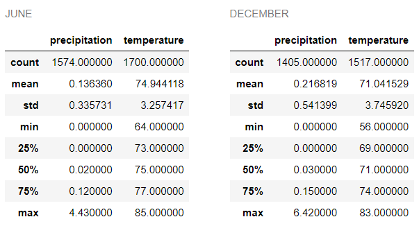

# Surfs_up

## Background
An analysis of the climate was to be performed to strengthen the idea of opening a surfing and icecream shop in Oahu, Hawaii.  The weather data from 9 weather stations was used for the analysis.  The data was extracted from an SQLite database.  A query of the data from the last 12 months was used for the analysis.  The investor of the project would like to analyze the date from June and December to ensure that the investment is fool proof.

## Analysis

Once connected to the SQLite database, the describe function along with the filter of the month of June and December was used to extract the statistical information.

The analysis indicates that:

* the average temperature during December is slightly cooler than in June ( 75 F vs 71 F) but the minimum temperature recorded was much cooler than the minimum temperature recorded in June ( 64 F in June and 56 F in December)
* the maximum temperatures are not so different between the two months (85 F in June and 83 F in December)
* the average precipitation is slightly higher in December than in June but is of no concern at all (0.21 vs 0.13)

## Recommendations

*  Since there are only 9 weather Stations, it would benefit from further analysis of the statistical data from each station.  Stations located in the mountains, windward side and leeward side may have differences.
*  Water temperatures are to be included in the analysis as the nature of the business (surfing) has an impact on this.
*  Location of the surf shop may be an important decision to make and the weather station closest to it may be individually analyzed.
*  The weather date from a year of information may not be adequate to predict the general climate of the island.  More years must be added to the analysis.
